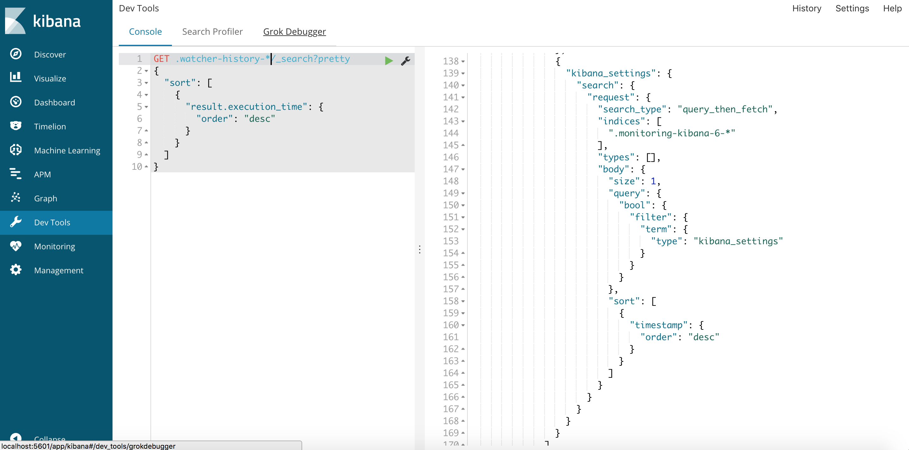

# Elastic Search, Logstash and Kibana 

This quick post will get you up and running with the elk stack.

If you want to generate movies.json then do the following command:

`go run main.go > movies.json`

If you want to generate tags.json then do the following command:

`cd tags; go run main.go > tag.json`

Install elasticsearch via homebrew:

```bash
brew install elasticsearch
```

Install kibana via homebrew:

```bash
brew install kibana
```

Install logstash via homebrew:

```bash
brew install logstash
```

Make sure that all the services are up and running:

```bash
brew services start kibana
brew services start elasticsearch
brew services start logstash
```

You should see all the services up and running:

```bash
brew services list
```

Make sure that the elastic stack is up and running:

```curl
curl -X GET 127.0.0.1:9200
{
  "name" : "M43AiJz",
  "cluster_name" : "elasticsearch_jean-marcelbelmont",
  "cluster_uuid" : "8dHbumffQ3iAOUU32Sx1Jw",
  "version" : {
    "number" : "6.2.2",
    "build_hash" : "10b1edd",
    "build_date" : "2018-02-16T19:01:30.685723Z",
    "build_snapshot" : false,
    "lucene_version" : "7.2.1",
    "minimum_wire_compatibility_version" : "5.6.0",
    "minimum_index_compatibility_version" : "5.0.0"
  },
  "tagline" : "You Know, for Search"
}
```

You can see all the indices available with the following command:

```curl
curl -X GET 127.0.0.1:9200/_cat/indices?v
health status index                           uuid                   pri rep docs.count docs.deleted store.size pri.store.size
yellow open   logstash-2017.05.04             hfY9yL1vTt-IQGE8G591VQ   5   1      16762            0      7.1mb          7.1mb
green  open   .monitoring-es-6-2018.03.18     FWPFXqVBTWmt84HfT4-_Pw   1   0       9903            0      5.7mb          5.7mb
yellow open   logstash-2017.05.02             T6DtDxYJQEm_rwaXg_YLfA   5   1      16278            0        7mb            7mb
green  open   .monitoring-kibana-6-2018.03.18 -tr0EU_0T16tskWdvbGBmg   1   0        314            0    197.5kb        197.5kb
green  open   .triggered_watches              zcs8Nqi2SQ6sUVI2TsBTUg   1   0          0            0     16.2kb         16.2kb
yellow open   app                             oRwQ4n5aSOqFZ_sWPg_iuA   5   1          1            0      5.4kb          5.4kb
yellow open   tags                            CY18aLQuQt-VsLZDce2kZw   5   1       1296            0    342.4kb        342.4kb
yellow open   movies                          141JB-VbTxylwb6IFP6JKA   5   1       9125            0      1.3mb          1.3mb
yellow open   logstash-2017.04.30             TH83PAHZTL6utR_wgxXU9A   5   1      14166            0      6.3mb          6.3mb
yellow open   ratings                         4QXKvkNsTmGVayapswxwcA   5   1     100004            0     13.4mb         13.4mb
green  open   .watches                        XMyhvohjTiSj1sG-ek97nw   1   0          6            0     33.3kb         33.3kb
yellow open   logstash-2017.05.01             8Cs8mEyXSuW_jTQXdUXubg   5   1      15948            0      6.9mb          6.9mb
yellow open   logs                            lXA5H-V_QSOrySGg6r6R1Q   5   1          1            0      5.8kb          5.8kb
yellow open   logstash-2017.05.05             e1hwj1ddQDK69ZmKaRFi5A   5   1      18646            0      7.7mb          7.7mb
yellow open   testindex                       RaI2XDStSBqDEz-jgl-5RQ   3   1          0            0       783b           783b
green  open   .watcher-history-7-2018.03.18   mfe3zaV3Qvib5XLPBA1W0A   1   0        502            0    730.4kb        730.4kb
green  open   .monitoring-alerts-6            IdSXd-D9RNqlGYXcWThGiA   1   0          1            0      6.1kb          6.1kb
yellow open   shakespeare                     EjHjJW8WTpCe4ZyeOhAJXA   5   1     111396            0     21.6mb         21.6mb
green  open   .kibana                         aZ2Fhv-PSsOf5BUTlDdhkw   1   0        143            1    142.5kb        142.5kb
yellow open   logstash-2017.05.03             nklpkzxxSRCWOL990fD2Qg   5   1      21172            0      9.3mb          9.3mb
```

As you can tell there is a list of indices here

We will add some movies via the go script I created:

```curl
curl -X PUT -H "Content-Type: application/json" 127.0.0.1:9200/_bulk?pretty --data-binary @movies.json
```

This imports movies json file into elastic

Here we will create a new movie entry to movie index:

```curl
curl -X POST -H "Content-Type: application/json" 127.0.0.1:9200/movies/movie/180895/_update -d '
{
  "doc" : {
    "title": "BoneHead Man"
  }
}'
```

Here is an example of using filters in elastic search:

```curl
curl -X GET -H 'Content-Type: application/json' '127.0.0.1:9200/logstash-2017.05.04/_search?size=0&pretty' -d '
{
  "query": {
    "match": {
    "agent": "Googlebot"
   }
},
  "aggs": {
    "timestamp": {
      "date_histogram": {
        "field": "@timestamp", "interval": "minute"
      }
    }
  }
}'
```

This query will query and match via a user agent of `Googlebot` and will do an aggregation based on timestamp and use an interval of a minute

Instead of using `curl` you can use the Kibana Dashboard to help you do both queries and create indices and list indices and much more



Notice here that I clicked on the `Dev Tools` tab.

You get autocomplete functionality in the Dev tools and many other features.

You can add more functionality to elastic search by installing the x-pack and you can do the following:

`elasticsearch-plugin install x-pack`

Here are some more recommended plugins to install:

`elasticsearch-plugin install ingest-user-agent`

`elasticsearch-plugin install ingest-geoip`

Here is a copy of my `elasticsearch.yml` configuration file:

```yml
# ======================== Elasticsearch Configuration =========================
#
# NOTE: Elasticsearch comes with reasonable defaults for most settings.
#       Before you set out to tweak and tune the configuration, make sure you
#       understand what are you trying to accomplish and the consequences.
#
# The primary way of configuring a node is via this file. This template lists
# the most important settings you may want to configure for a production cluster.
#
# Please consult the documentation for further information on configuration options:
# https://www.elastic.co/guide/en/elasticsearch/reference/index.html
#
# ---------------------------------- Cluster -----------------------------------
#
# Use a descriptive name for your cluster:
#
cluster.name: elasticsearch_jean-marcelbelmont
#
# ------------------------------------ Node ------------------------------------
#
# Use a descriptive name for the node:
#
node.name: node-1
#
# Add custom attributes to the node:
#
#node.attr.rack: r1
#
# ----------------------------------- Paths ------------------------------------
#
# Path to directory where to store the data (separate multiple locations by comma):
#
path.data: /usr/local/var/lib/elasticsearch/
#
# Path to log files:
#
path.logs: /usr/local/var/log/elasticsearch/
#
# ----------------------------------- Memory -----------------------------------
#
# Lock the memory on startup:
#
#bootstrap.memory_lock: true
#
# Make sure that the heap size is set to about half the memory available
# on the system and that the owner of the process is allowed to use this
# limit.
#
# Elasticsearch performs poorly when the system is swapping the memory.
#
# ---------------------------------- Network -----------------------------------
#
# Set the bind address to a specific IP (IPv4 or IPv6):
#
#network.host: 192.168.0.1
#
# Set a custom port for HTTP:
#
#http.port: 9200
#
# For more information, consult the network module documentation.
#
# --------------------------------- Discovery ----------------------------------
#
# Pass an initial list of hosts to perform discovery when new node is started:
# The default list of hosts is ["127.0.0.1", "[::1]"]
#
#discovery.zen.ping.unicast.hosts: ["host1", "host2"]
#
# Prevent the "split brain" by configuring the majority of nodes (total number of master-eligible nodes / 2 + 1):
#
#discovery.zen.minimum_master_nodes: 
#
# For more information, consult the zen discovery module documentation.
#
# ---------------------------------- Gateway -----------------------------------
#
# Block initial recovery after a full cluster restart until N nodes are started:
#
#gateway.recover_after_nodes: 3
#
# For more information, consult the gateway module documentation.
#
# ---------------------------------- Various -----------------------------------
#
# Require explicit names when deleting indices:
#
#action.destructive_requires_name: true

xpack.security.enabled: false

node.max_local_storage_nodes: 2
```

You should also consider adding filebeat to the elastic search and you can add it with the following command:

`brew install filebeat`

Here is my configuration file for `filebeat.yml`:

```yml
###################### Filebeat Configuration Example #########################

# This file is an example configuration file highlighting only the most common
# options. The filebeat.reference.yml file from the same directory contains all the
# supported options with more comments. You can use it as a reference.
#
# You can find the full configuration reference here:
# https://www.elastic.co/guide/en/beats/filebeat/index.html

# For more available modules and options, please see the filebeat.reference.yml sample
# configuration file.

#=========================== Filebeat prospectors =============================

filebeat.prospectors:

# Each - is a prospector. Most options can be set at the prospector level, so
# you can use different prospectors for various configurations.
# Below are the prospector specific configurations.

- type: log

  # Change to true to enable this prospector configuration.
  enabled: false

  # Paths that should be crawled and fetched. Glob based paths.
  paths:
    - /var/log/*.log
    #- c:\programdata\elasticsearch\logs\*

  # Exclude lines. A list of regular expressions to match. It drops the lines that are
  # matching any regular expression from the list.
  #exclude_lines: ['^DBG']

  # Include lines. A list of regular expressions to match. It exports the lines that are
  # matching any regular expression from the list.
  #include_lines: ['^ERR', '^WARN']

  # Exclude files. A list of regular expressions to match. Filebeat drops the files that
  # are matching any regular expression from the list. By default, no files are dropped.
  #exclude_files: ['.gz$']

  # Optional additional fields. These fields can be freely picked
  # to add additional information to the crawled log files for filtering
  #fields:
  #  level: debug
  #  review: 1

  ### Multiline options

  # Mutiline can be used for log messages spanning multiple lines. This is common
  # for Java Stack Traces or C-Line Continuation

  # The regexp Pattern that has to be matched. The example pattern matches all lines starting with [
  #multiline.pattern: ^\[

  # Defines if the pattern set under pattern should be negated or not. Default is false.
  #multiline.negate: false

  # Match can be set to "after" or "before". It is used to define if lines should be append to a pattern
  # that was (not) matched before or after or as long as a pattern is not matched based on negate.
  # Note: After is the equivalent to previous and before is the equivalent to to next in Logstash
  #multiline.match: after


#============================= Filebeat modules ===============================

filebeat.config.modules:
  # Glob pattern for configuration loading
  path: ${path.config}/modules.d/*.yml

  # Set to true to enable config reloading
  reload.enabled: false

  # Period on which files under path should be checked for changes
  #reload.period: 10s

#==================== Elasticsearch template setting ==========================

setup.template.settings:
  index.number_of_shards: 3
  #index.codec: best_compression
  #_source.enabled: false

#================================ General =====================================

# The name of the shipper that publishes the network data. It can be used to group
# all the transactions sent by a single shipper in the web interface.
#name:

# The tags of the shipper are included in their own field with each
# transaction published.
#tags: ["service-X", "web-tier"]

# Optional fields that you can specify to add additional information to the
# output.
#fields:
#  env: staging


#============================== Dashboards =====================================
# These settings control loading the sample dashboards to the Kibana index. Loading
# the dashboards is disabled by default and can be enabled either by setting the
# options here, or by using the `-setup` CLI flag or the `setup` command.
#setup.dashboards.enabled: false

# The URL from where to download the dashboards archive. By default this URL
# has a value which is computed based on the Beat name and version. For released
# versions, this URL points to the dashboard archive on the artifacts.elastic.co
# website.
#setup.dashboards.url:

#============================== Kibana =====================================

# Starting with Beats version 6.0.0, the dashboards are loaded via the Kibana API.
# This requires a Kibana endpoint configuration.
setup.kibana:

  # Kibana Host
  # Scheme and port can be left out and will be set to the default (http and 5601)
  # In case you specify and additional path, the scheme is required: http://localhost:5601/path
  # IPv6 addresses should always be defined as: https://[2001:db8::1]:5601
  host: "localhost:5601"

#============================= Elastic Cloud ==================================

# These settings simplify using filebeat with the Elastic Cloud (https://cloud.elastic.co/).

# The cloud.id setting overwrites the `output.elasticsearch.hosts` and
# `setup.kibana.host` options.
# You can find the `cloud.id` in the Elastic Cloud web UI.
#cloud.id:

# The cloud.auth setting overwrites the `output.elasticsearch.username` and
# `output.elasticsearch.password` settings. The format is `<user>:<pass>`.
#cloud.auth:

#================================ Outputs =====================================

# Configure what output to use when sending the data collected by the beat.

#-------------------------- Elasticsearch output ------------------------------
output.elasticsearch:
  # Array of hosts to connect to.
  hosts: ["localhost:9200"]

  # Optional protocol and basic auth credentials.
  #protocol: "https"
  #username: "elastic"
  #password: "changeme"

#----------------------------- Logstash output --------------------------------
#output.logstash:
  # The Logstash hosts
  #hosts: ["localhost:5044"]

  # Optional SSL. By default is off.
  # List of root certificates for HTTPS server verifications
  #ssl.certificate_authorities: ["/etc/pki/root/ca.pem"]

  # Certificate for SSL client authentication
  #ssl.certificate: "/etc/pki/client/cert.pem"

  # Client Certificate Key
  #ssl.key: "/etc/pki/client/cert.key"

#================================ Logging =====================================

# Sets log level. The default log level is info.
# Available log levels are: error, warning, info, debug
#logging.level: debug

# At debug level, you can selectively enable logging only for some components.
# To enable all selectors use ["*"]. Examples of other selectors are "beat",
# "publish", "service".
#logging.selectors: ["*"]

#============================== Xpack Monitoring ===============================
# filebeat can export internal metrics to a central Elasticsearch monitoring
# cluster.  This requires xpack monitoring to be enabled in Elasticsearch.  The
# reporting is disabled by default.

# Set to true to enable the monitoring reporter.
#xpack.monitoring.enabled: false

# Uncomment to send the metrics to Elasticsearch. Most settings from the
# Elasticsearch output are accepted here as well. Any setting that is not set is
# automatically inherited from the Elasticsearch output configuration, so if you
# have the Elasticsearch output configured, you can simply uncomment the
# following line.
#xpack.monitoring.elasticsearch:
```

You will also need to configure `logstash.conf` file.

Here is my configuration file:

```
input {
	file {
		path => "/Users/jean-marcelbelmont/elk/access_log"
		start_position => "beginning"
		ignore_older => 0
	}
}

filter {
	grok {
		match => { "message" => "%{COMBINEDAPACHELOG}" }
	}
	date {
		match => [ "timestamp", "dd/MMM/yyyy:HH:mm:ss Z" ]
	}
}

output {
	elasticsearch {
		hosts => [ "localhost:9200" ]
	}
	stdout {
		codec => rubydebug
	}
}
```

Here I spin up logstash with my configuration file: `sudo logstash -f /etc/logstash/conf.d/logstash.conf`

I would highly suggest you check out [Frank Kanes Udemy Course on the Elastic Stack](https://www.udemy.com/elasticsearch-6-and-elastic-stack-in-depth-and-hands-on)
